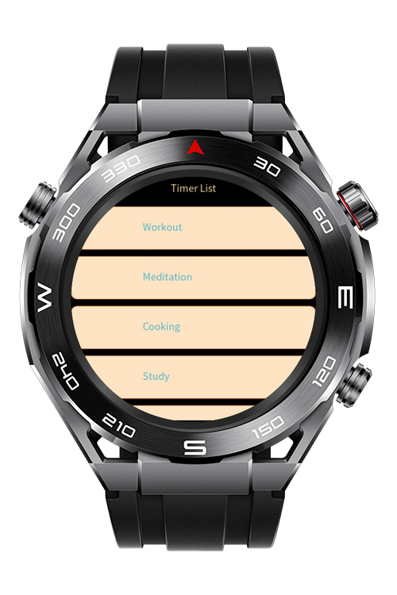
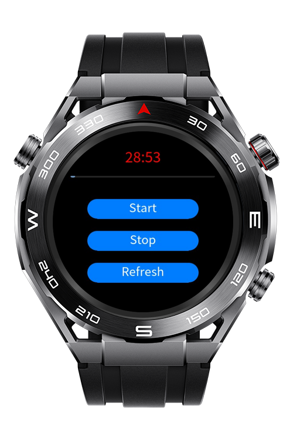

> **Note:** To access all shared projects, get information about environment setup, and view other guides, please visit [Explore-In-HMOS-Wearable Index](https://github.com/Explore-In-HMOS-Wearable/hmos-index).

# Sportwatch Productivity Timer

ProductivityTimer is a lightweight HarmonyOS Lite Wearable application designed to help users manage tasks and stay focused through a simple countdown timer experience.

The app includes two main screens: a task list and a timer screen. The task list shows activities that may need time tracking, such as meetings or study sessions, and tapping on any item opens the timer. The timer screen starts a 30-minute countdown, displays the remaining time with a progress bar, and lets the user start, pause, or reset the timer. The watch vibrates once when 30 seconds remain and again when the countdown finishes.

# Preview

<div>
  
  
</div>


# Use Cases

- Select a task from the list to open the timer screen.

- Begin a 30-minute countdown using the Start button.

- View time decreasing in MM:SS format while the progress bar updates dynamically.

- Receive a vibration alert when 30 seconds remain.
 
- Use Pause to stop and Start to resume from the same point.

- Use Reset to restore the timer to its default value (30:00).

- When the timer reaches zero, a short vibration notifies task completion.

# Technology

## Stack
**Languages**: Javascript

**Frameworks**: HarmonyOS SDK 5.0.0(12) - 5.1.0(18)

**Tools**: DevEco Studio Vers 5.1.1.830

**Libraries**: @system.vibrator, @system.router


## Required Permissions

- `ohos.permission.VIBRATE`


# Directory Structure

```
ProductivityTimer/
│
├── entry/
│   └── src/
│       └── main/
│           ├── js/
│           │   └── MainAbility/
│           │       ├── app.js                    # Application lifecycle
│           │       └── pages/
│           │           ├── index/                # Task list screen
│           │           │   ├── index.css
│           │           │   ├── index.hml
│           │           │   └── index.js
│           │           ├── timer/                # Countdown timer screen
│           │           │   ├── timer.css 
│           │           │   ├── timer.hml 
│           │           │   └── timer.js 
│           ├── resources/
│           │   └── base/
│           │       ├── element/
│           │       │   └── string.json           # Resource strings
│           │       └── media/
│           └── config.json                       # Entry configuration file
```


# Constraints and Restrictions

## Supported Device
  - Huawei Sport (Lite) Watch GT 4/5/6
  - Huawei Sport (Lite) GT4/5 Pro
  - Huawei Sport (Lite) Fit 3/4
  - Huawei Sport (Lite) D2
  - Huawei Sport (Lite) Ultimate


# License

Sportwatch Productivity Timer is distributed under the terms of the MIT License.

See the [LICENSE](/LICENSE) for more information.